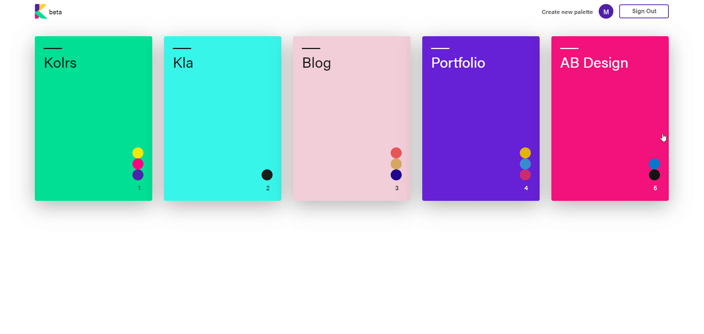
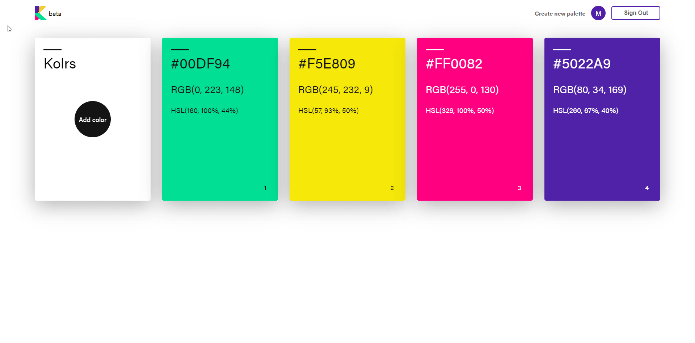
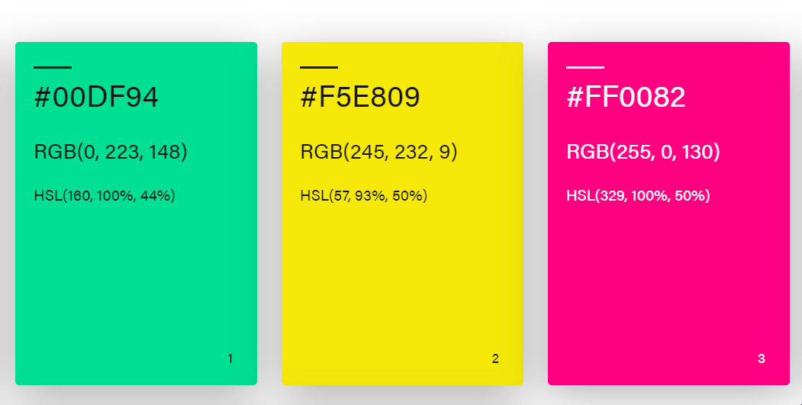
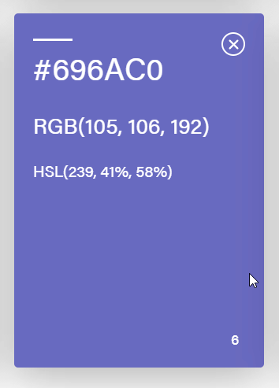
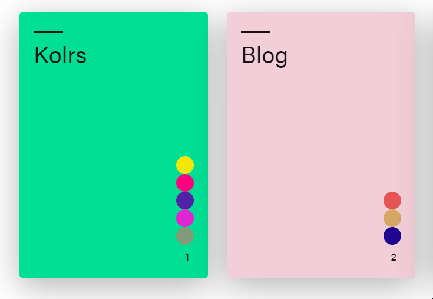
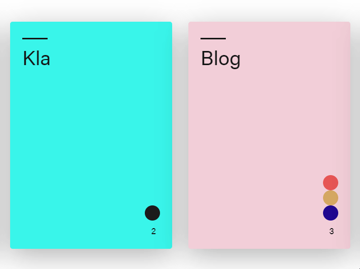

# Kolrs beta 🎨

#### A better way to create and save your color palettes.


Create, collect, and organize colors all in one place.

## Demo
👉 Check it <a href="https://youtu.be/mXDrn1Nwev0">here</a>.


### Easy to use

#### 👉 Sign Up with Google or Email/Password


#### 👉 Create new Palette and add first color


#### 👉 Save as much colors as you need



#### 👉 Copy the color value with one just click



#### 👉 Remove the color from the palette



#### 👉 Get a quick preview of all the colors in the palette


#### 👉 Remove the palette



## ToDo

- [ ] Performance Optimization
- [ ] Add Animation
- [ ] Firebase Anonymous SingUp/Login
- [x] Local auth persistence
- [ ] Chrome Plugin


### In Works
💻 chrome plugin to scan/add colors from any website


### For developers
Clone the source locally:

```sh
$ git clone https://github.com/miloslavc/Kolrs
$ cd kolrs
```

Install project dependencies:

```sh
$ yarn
```
Start the app:

```sh
$ yarn start
```


### Built with
- [React](https://github.com/facebook/react)
- [Emotion](https://github.com/emotion-js/emotion)

### Thanks
- [tinycolor](https://github.com/bgrins/TinyColor)
- [react-color](https://github.com/emotion-js/emotion)

#### License

MIT  © [Miloslav Cvetkovic](http://miloslavc.com)
