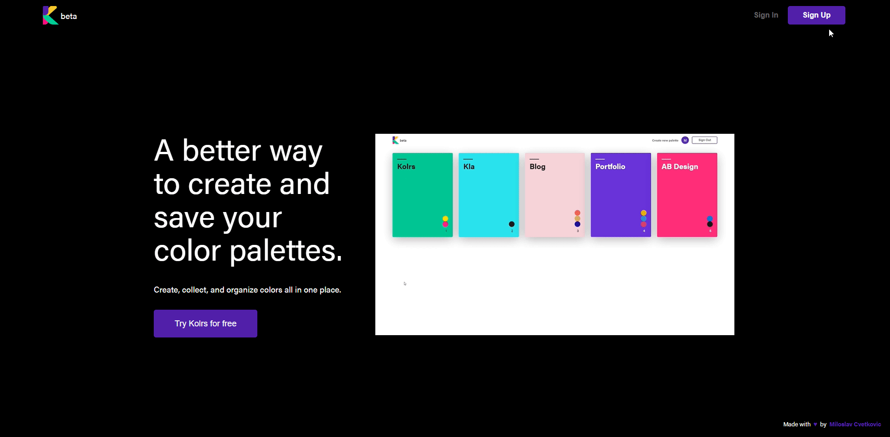
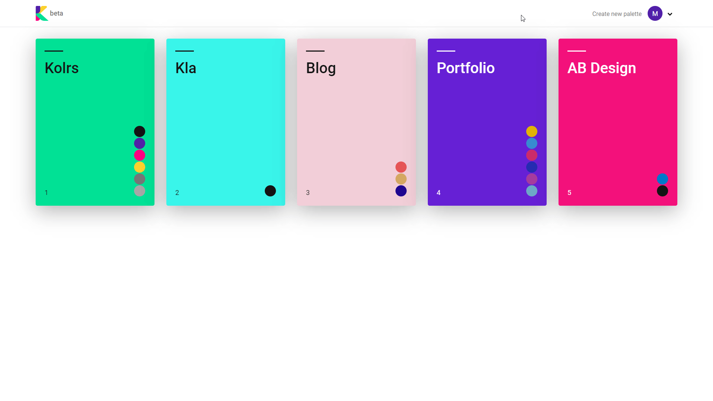
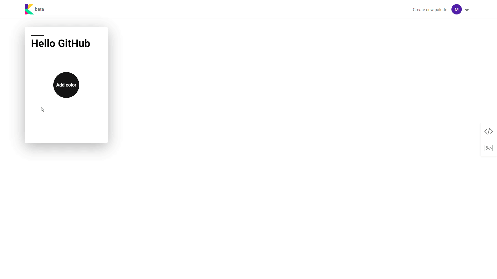
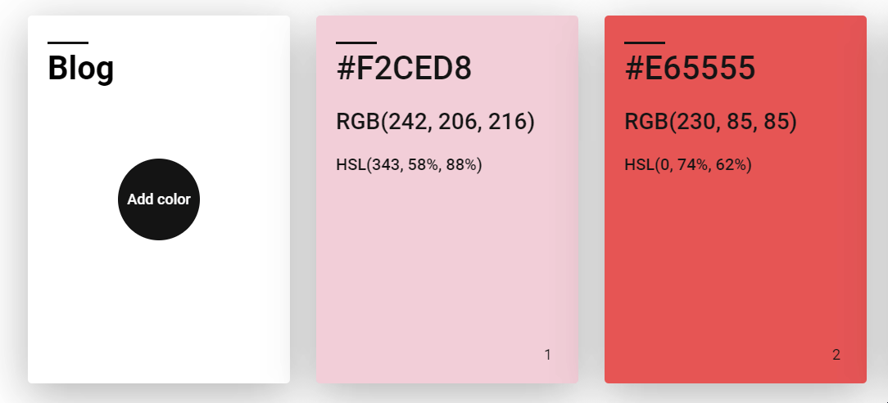
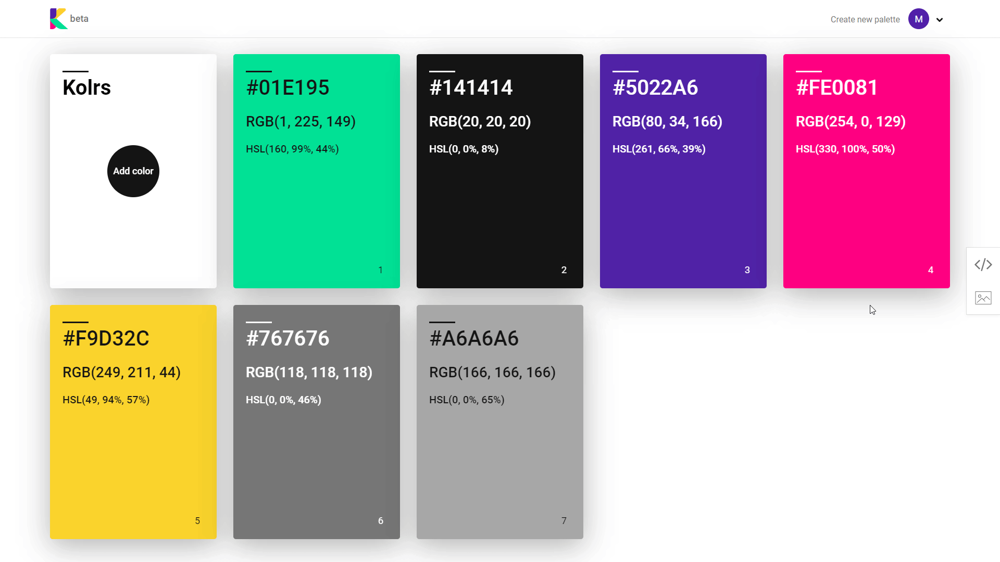
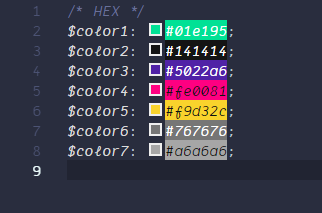
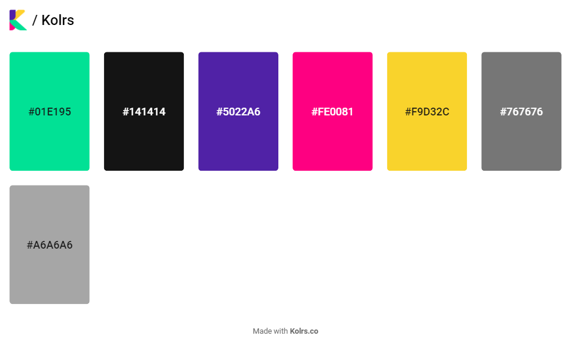
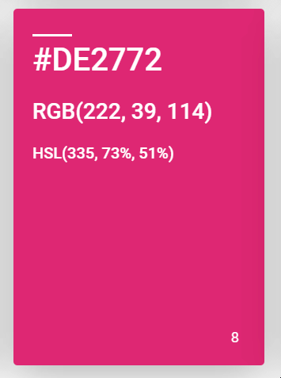
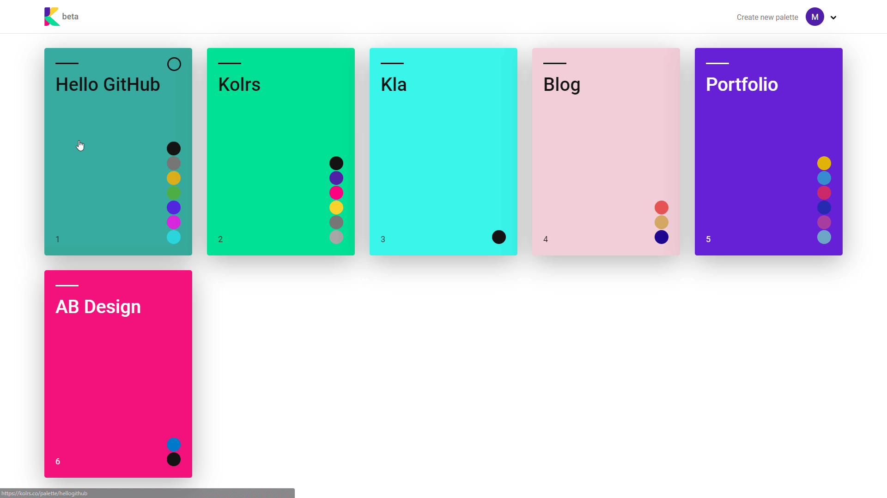
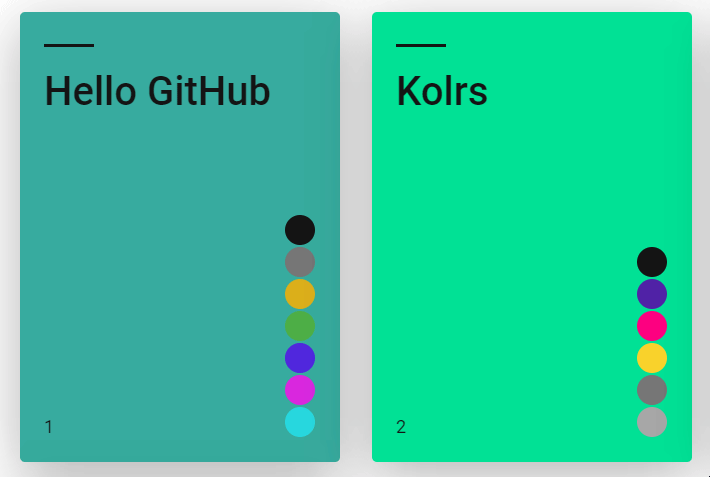

# Kolrs beta 🎨

#### A better way to create and save your color palettes.


Create, collect, and organize colors all in one place.

## Demo
👉 Video introduction to <a href="https://youtu.be/mXDrn1Nwev0">Kolrs</a>.

## Introduction


#### 👉 Login/Sign Up with Google or Email/Password



## Creating New palette

#### 👉 Create new Palette


#### 👉 Add colors by selecting a shade from the color picker or by inputting HEX or RGB values


#### 👉 Each Palette can contain unlimited number of colors


## How to access color values

#### 👉 Copy the color value(HEX,RGB,HSL) with just one click


## Export Palettes

#### 👉 Entire Palette can be exported as SCSS or PNG image



####  SCSS file


####  PNG file


## How to remove color from the Palette

#### 👉 In Order to remove the color from the palette, just click on the delete button that will appear once the mouse cursor hovers over the given color


## Palettes

#### 👉 Back at the home page of the application, users can see all their saved palettes as well as quickly preview all colors that each palette contains simply by clicking the color dots.


#### 👉 Remove the palette



## ToDo

- [x] Performance Optimization
- [x] Local auth persistence
- [ ] Add Animation
- [ ] Firebase Anonymous SingUp/Login
- [ ] Web Extension


### In Works
💻 Web Extension to scan/add colors from any website


## For developers
Clone the source locally:

```sh
$ git clone https://github.com/miloslavc/Kolrs
$ cd kolrs
```

Install project dependencies:

```sh
$ yarn
```
Start the app:

```sh
$ yarn start
```


### Built with
- [React](https://github.com/facebook/react)
- [Emotion](https://github.com/emotion-js/emotion)

### Dependencies
- [tinycolor](https://github.com/bgrins/TinyColor)
- [react-color](https://github.com/casesandberg/react-color)
- [html2canvas](https://html2canvas.hertzen.com/)
- [reach router](https://github.com/reach/router)
- [react-copy-to-clipboard](https://github.com/nkbt/react-copy-to-clipboard)

#### License

MIT  © [Miloslav Cvetkovic](http://miloslavc.com)
